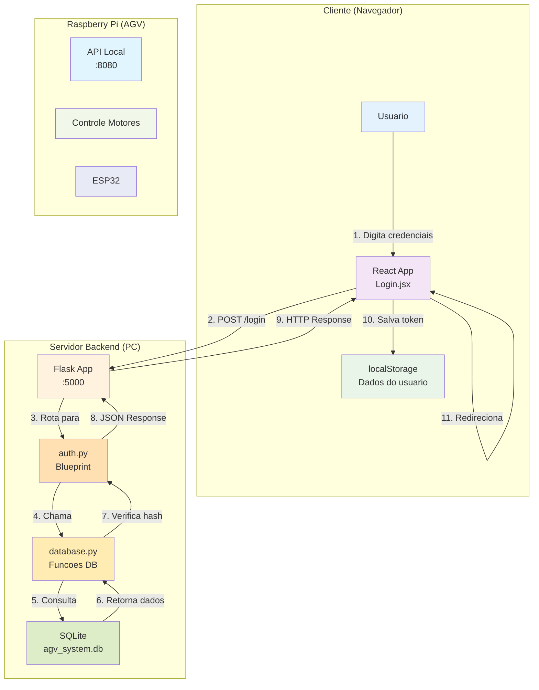
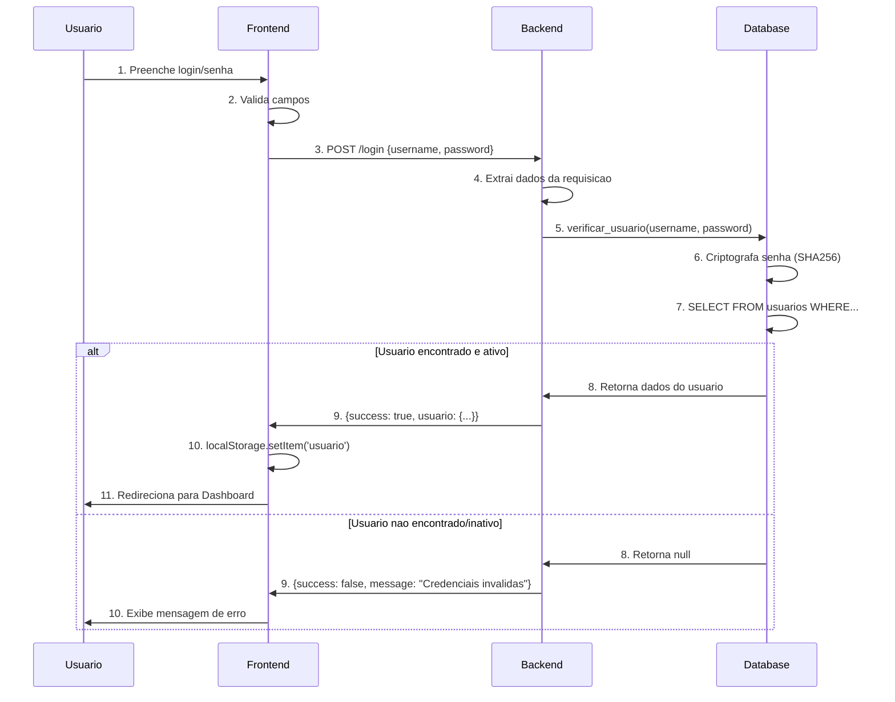

# Arquitetura do Sistema de Autenticação - AGV

## Diagrama de Arquitetura

```mermaid
graph TB
    subgraph "Cliente (Navegador)"
        A[Usuario]
        B[React App<br/>Login.jsx]
        C[localStorage<br/>Dados do usuario]
    end
    
    subgraph "Servidor Backend (PC)"
        D[Flask App<br/>:5000]
        E[auth.py<br/>Blueprint]
        F[database.py<br/>Funcoes DB]
        G[SQLite<br/>agv_system.db]
    end
    
    subgraph "Raspberry Pi (AGV)"
        H[API Local<br/>:8080]
        I[Controle Motores]
        J[ESP32]
    end
    
    A -->|1. Digita credenciais| B
    B -->|2. POST /login| D
    D -->|3. Rota para| E
    E -->|4. Chama| F
    F -->|5. Consulta| G
    G -->|6. Retorna dados| F
    F -->|7. Verifica hash| E
    E -->|8. JSON Response| D
    D -->|9. HTTP Response| B
    B -->|10. Salva token| C
    B -->|11. Redireciona| B
    
    style A fill:#e3f2fd
    style B fill:#f3e5f5
    style C fill:#e8f5e8
    style D fill:#fff3e0
    style E fill:#ffe0b2
    style F fill:#ffecb3
    style G fill:#dcedc8
    style H fill:#e1f5fe
    style I fill:#f1f8e9
    style J fill:#e8eaf6
```

## Fluxo de Autenticação Simplificado

```mermaid
sequenceDiagram
    participant U as Usuario
    participant F as Frontend
    participant B as Backend
    participant D as Database
    
    U->>F: 1. Preenche login/senha
    F->>F: 2. Valida campos
    F->>B: 3. POST /login {username, password}
    B->>B: 4. Extrai dados da requisicao
    B->>D: 5. verificar_usuario(username, password)
    D->>D: 6. Criptografa senha (SHA256)
    D->>D: 7. SELECT FROM usuarios WHERE...
    alt Usuario encontrado e ativo
        D->>B: 8. Retorna dados do usuario
        B->>F: 9. {success: true, usuario: {...}}
        F->>F: 10. localStorage.setItem('usuario')
        F->>U: 11. Redireciona para Dashboard
    else Usuario nao encontrado/inativo
        D->>B: 8. Retorna null
        B->>F: 9. {success: false, message: "Credenciais invalidas"}
        F->>U: 10. Exibe mensagem de erro
    end
```