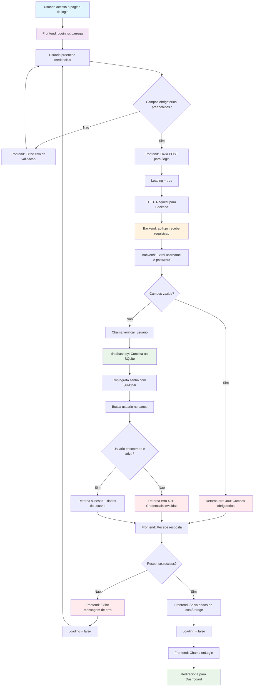

# Fluxograma do Sistema de Login - AGV Dashboard

## Descrição
Este fluxograma representa o fluxo completo de autenticação entre o front-end (React) e o back-end (Flask) do sistema AGV.

## Fluxograma em Mermaid



## Componentes do Fluxo

### 1. Frontend (React)
- **Arquivo**: `agv-web/frontend/src/pages/Login.jsx`
- **Responsabilidades**:
  - Capturar credenciais do usuário
  - Validar campos obrigatórios
  - Enviar requisição HTTP para backend
  - Gerenciar estados (loading, erro)
  - Salvar dados do usuário autenticado
  - Redirecionar para dashboard

### 2. Backend (Flask)
- **Arquivo**: `agv-web/backend/api/auth.py`
- **Endpoint**: `POST /login`
- **Responsabilidades**:
  - Receber e validar dados da requisição
  - Chamar função de verificação de usuário
  - Retornar resposta apropriada

### 3. Banco de Dados (SQLite)
- **Arquivo**: `agv-web/backend/database.py`
- **Função**: `verificar_usuario()`
- **Responsabilidades**:
  - Criptografar senha com SHA256
  - Consultar usuário no banco
  - Verificar se está ativo
  - Retornar dados do usuário

## Estados de Resposta

### ✅ Sucesso (200)
```json
{
  "success": true,
  "message": "Login realizado com sucesso",
  "usuario": {
    "id": 1,
    "nome": "João Silva",
    "username": "joao",
    "perfil": "funcionario"
  }
}
```

### ❌ Campos Obrigatórios (400)
```json
{
  "success": false,
  "message": "Username e senha são obrigatórios"
}
```

### ❌ Credenciais Inválidas (401)
```json
{
  "success": false,
  "message": "Credenciais inválidas"
}
```

## Fluxo de Dados

1. **Entrada**: Username e Password
2. **Processamento**: Validação → Criptografia → Consulta DB
3. **Saída**: Dados do usuário ou mensagem de erro

## Segurança

- ✅ Senhas criptografadas com SHA256
- ✅ Validação de campos obrigatórios
- ✅ Verificação de usuário ativo
- ✅ Tratamento de erros padronizado
- ✅ Estados de loading no frontend

## URLs e Endpoints

- **Frontend**: `http://localhost:3000/login`
- **Backend API**: `http://localhost:5000/login`
- **Método**: POST
- **Content-Type**: application/json